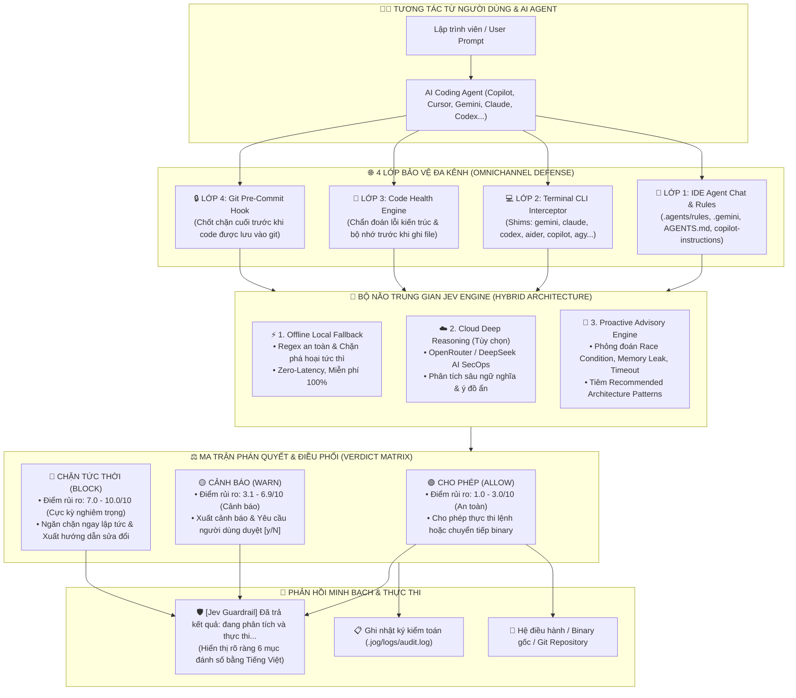

# 🛡️ Jev Omnichannel Guardrail (JOG) `v1.0.0`

> ### ⚡ **MỌI QUYẾT ĐỊNH CỦA AGENT KHI CODE ĐỀU ĐƯỢC QUYẾT ĐỊNH BỞI JEV ĐÃ ĐƯỢC PHỎNG ĐOÁN VÀ TỐI ƯU**

> **Hệ thống phòng thủ đa kênh (Omnichannel Defense) & Định hướng kiến trúc thông minh cho AI Coding Agents (Cursor, VS Code Copilot, Gemini CLI, Antigravity, Claude Code, Codex, Devin, Windsurf).**  
> Đóng vai trò là **bộ não trung gian độc lập (Zero-Trust Intermediary Proxy)**: đứng giữa Lập trình viên, AI Agent và Hệ điều hành để ngăn chặn ảo giác, chặn lệnh phá hoại, bảo vệ API key, tối ưu hóa chi phí token và nâng cao độ bền vững cho mã nguồn sản phẩm.

---

## 🧩 Vai Trò & Công Dụng Toàn Diện Khi Tích Hợp Jev Làm Bộ Não Trung Gian (Intermediary Proxy)

### ❓ Vì sao AI Coding Agent bắt buộc cần một Bộ Não Trung Gian?
Trong mô hình truyền thống, khi lập trình viên đưa ra câu lệnh, AI Agent sẽ trực tiếp sinh mã nguồn và thực thi các câu lệnh terminal vào hệ điều hành mà **không hề có bất kỳ lớp rà soát bảo vệ hay định hướng độc lập nào**. Điều này dẫn đến 4 nguy cơ sống còn:
1. **Ảo giác phá hoại (Hallucination)**: AI có thể tự ý chạy các lệnh shell hủy diệt dữ liệu (`rm -rf /`, format disk, sửa file cấu hình nhạy cảm).
2. **Rò rỉ bí mật (Credential Leaks)**: AI vô tình đưa API Key, mật khẩu, JWT Token vào commit Git hoặc gửi lên cloud.
3. **Mã nguồn suy thoái (Code Degradation)**: Sinh ra code có lỗi kiến trúc nghiêm trọng (Memory Leak, N+1 Query, thiếu timeout, race condition) khiến ứng dụng sập khi tải cao.
4. **Vòng lặp đốt Token (Token Burning)**: Agent viết code lỗi ➔ người dùng báo lỗi ➔ Agent sinh mã sửa chắp vá lặp đi lặp lại, lãng phí hàng trăm ngàn token vô ích.

---

### 🛡️ Mô Hình Hoạt Động Trung Gian Của Jev:
```text
[Lập trình viên] 
       │
       ▼ (1. Nhận yêu cầu tính năng)
[JEV GUARDRAIL: Phỏng đoán rủi ro tương lai & Tiêm chỉ thị kiến trúc]
       │
       ▼ (2. Prompt đã được tối ưu hóa ngữ cảnh chuẩn mực)
[AI CODING AGENT: Sinh mã nguồn & Lập kế hoạch hành động]
       │
       ▼ (3. Đánh chặn câu lệnh terminal & Kiểm định chất lượng code trước khi lưu)
[JEV DECISION ENGINE: Trọng tài phê duyệt ALLOW / WARN / BLOCK]
       │
       ▼ (4. Chỉ thực thi khi an toàn & đạt chuẩn)
[Hệ Điều Hành / File System / Git Repository]
```

---

### 🌟 6 Công Dụng Toàn Diện Khi Jev Đóng Vai Trò Là Bộ Não Trung Gian:

#### 1. ⚖️ Trọng Tài Thẩm Định & Phê Duyệt Mọi Hành Động (Execution Gatekeeper)
* Khi Agent muốn chạy bất kỳ câu lệnh nào trong terminal (cài package lạ, gọi lệnh bash, build project, truy cập mạng), Jev đóng vai trò là **chốt chặn phê duyệt**:
  * **ALLOW (Cho phép)**: Tiến hành thực thi mượt mà nếu lệnh an toàn.
  * **WARN (Cảnh báo)**: Tạm dừng và yêu cầu lập trình viên xác nhận `[y/N]` nếu lệnh có rủi ro tiềm ẩn.
  * **BLOCK (Chặn tức thời)**: Hủy ngay lập tức các lệnh nguy hiểm (xóa hệ thống, rò rỉ secret) và gửi hướng dẫn khắc phục cho Agent.

#### 2. 🔮 Phỏng Đoán Rủi Ro & Tiêm Chỉ Thị Kiến Trúc Đón Đầu (Proactive Architecture Advisory)
* Ngay từ bước đọc yêu cầu của người dùng, Jev phân tích bản chất tính năng (Realtime, Upload, Thanh toán, Auth, Caching, DB Query...) và **phỏng đoán trước toàn bộ các ca biên (Edge cases)** nguy hiểm:
  * *Ví dụ*: Làm Realtime thì phải có Heartbeat Ping/Pong tránh Zombie connection; Làm giao dịch tài chính thì phải xử lý Double Spending và Race Condition; Gọi API bên ngoài thì bắt buộc phải gán Timeout và Retry with Backoff.
* Jev tiêm sẵn các **Recommended Architecture Patterns** vào luồng suy nghĩ của Agent, đảm bảo Agent thiết kế code bao quát trọn vẹn các case này ngay từ đầu.

#### 3. 🔐 Bộ Lọc An Ninh & Chống Rò Rỉ Dữ Liệu Tuyệt Đối (Secret & Credential Scrubber)
* Đứng giữa Agent và môi trường lưu trữ, Jev quét theo thời gian thực mọi chuỗi prompt, tệp mã nguồn và output:
  * Phát hiện và ngăn chặn việc hardcode Private Keys, JWT Tokens, Database URI, OpenRouter/OpenAI API Keys.
  * Đảm bảo bí mật không bao giờ bị lộ ra ngoài giao diện chat, nhật ký audit hay lịch sử Git commit.

#### 4. ⚡ Tối Ưu Hóa Vòng Đời Suy Luận & Tiết Kiệm Chi Phí Token (Token Lifecycle Optimizer)
* Nhờ việc được tiêm chuẩn mực kiến trúc và phạm vi an toàn ngay từ lượt prompt đầu tiên, AI Agent không còn tình trạng "viết thử - thấy lỗi - sửa chắp vá".
* Mã nguồn sinh ra chính xác ngay trong 1 lần suy luận duy nhất, giúp **tiết kiệm từ 40% đến 70% lượng token tiêu thụ** cho toàn bộ dự án.

#### 5. 🏗️ Giám Hộ Độ Bền Vững & Khử Suy Thoái Mã Nguồn (Codebase Integrity Assurance)
* Trước khi Agent lưu bất kỳ tệp code nào xuống đĩa cứng, Jev phân tích tĩnh để ngăn chặn các "khoản nợ kỹ thuật" (Technical Debt):
  * Không cho phép truy vấn cơ sở dữ liệu dạng N+1.
  * Bắt buộc giải phóng tài nguyên (Close Stream, Database Connection Pool, Unsubscribe Event Listener).
  * Chống các lỗ hổng Injection (SQLi, Command Injection, XSS).

#### 6. 👁️ Minh Bạch Hóa Toàn Diện Quá Trình Suy Nghĩ Của AI (Realtime Observability)
* Mọi hành động của Agent đều được Jev ghi nhận vào nhật ký kiểm toán `.jog/logs/audit.log` và phản hồi minh bạch lên màn hình chat bằng định dạng Tiếng Việt chuẩn mực có đánh số:
  ```text
  🛡️ [Jev Guardrail] Đã trả kết quả: đang phân tích và thực thi...
  1 - Kết luận hành động: Cho phép
  2 - Điểm số ý định phá hoại: 1.0/10 (An toàn)
  ...
  ```
* Lập trình viên luôn nắm quyền kiểm soát tuyệt đối (Human-in-the-loop) đối với mọi quyết định của AI.

---

## 🔄 Sơ Đồ Luồng Hoạt Động (Flow Diagram)



---

## ⚡ 1. Khởi Chạy Nhanh (Zero-Setup)

> 💡 **Tự động 100% trên cả 3 Hệ Điều Hành (Windows, macOS, Linux):**
> - **Máy đã có Python:** Chạy bảo vệ ngay lập tức.
> - **Máy chưa có Python:** Tự động tải và cấu hình môi trường Python 3.12 (qua `winget/msi` trên Windows, `brew/pkg` trên macOS, `apt/dnf/pacman` trên Linux).
> - **Không phụ thuộc thư viện ngoài:** Chạy hoàn toàn bằng thư viện tiêu chuẩn của Python (không cần `pip install`).

### Kích hoạt cho thư mục hiện tại:
```bash
guar active
```

### Kích hoạt bảo vệ cho một dự án cụ thể:
```bash
guar active /duong/dan/toi/du_an
```

---

## 📋 2. Bảng Tra Cứu Lệnh Quản Trị

| Chức năng | Câu lệnh | Mô tả |
| :--- | :--- | :--- |
| **Kích hoạt bảo vệ** | `guar active` *(hoặc `jog active`)* | Cài đặt shims, nạp quy tắc IDE, cài Git hook và bật giám sát |
| **Kiểm tra trạng thái** | `guar status` | Xem trạng thái kích hoạt của IDE rules, Git hook và CLI shims |
| **Giám sát Realtime** | `guar watch` | Mở màn hình theo dõi trực tiếp các prompt và mã nguồn agent đang gọi |
| **Kiểm tra thủ công câu lệnh** | `jog check prompt "<lệnh>"` | Đánh giá an toàn và phỏng đoán rủi ro cho một câu lệnh |
| **Kiểm tra tệp mã nguồn** | `jog check code <tệp_mã>` | Đánh giá an ninh, rò rỉ tài nguyên và lỗi kiến trúc tương lai |
| **Hủy kích hoạt** | `guar deactive` | Gỡ bỏ sạch sẽ toàn bộ shims, rules và Git hook |

---

## 📊 3. Định Dạng Kết Quả Đánh Giá Chuẩn Hóa

Mỗi khi câu lệnh hoặc mã nguồn được thẩm định, Jev Guardrail xuất kết quả theo định dạng số thứ tự Tiếng Việt trực quan:

```text
─────────────────────────────────────────────────────────────────
🛡️  KẾT QUẢ ĐÁNH GIÁ AN TOÀN & Ý ĐỊNH HỆ THỐNG
─────────────────────────────────────────────────────────────────
1 - Kết luận hành động: Cho phép
2 - Điểm số ý định phá hoại: 1.0/10 (An toàn)
3 - Phát hiện lộ bí mật / API Key: Không
4 - Nguồn thẩm định: OpenRouter Cloud
5 - Chi tiết phân tích:
    • Câu lệnh an toàn, không chứa tham số độc hại.
    • Không phát hiện rò rỉ token hoặc biến môi trường nhạy cảm.
6 - Hướng dẫn sửa đổi: Không cần sửa đổi
─────────────────────────────────────────────────────────────────
```

---

## 🔑 4. Cấu Hình AI Cloud Reasoning (Tùy Chọn)

*(Mặc định hệ thống chạy **Offline 100% miễn phí** không bắt buộc cần API Key. Nếu muốn bật thêm chế độ AI Cloud Reasoning phân tích chuyên sâu qua DeepSeek/OpenRouter):*

1. **Lấy API Key:** Truy cập **[https://openrouter.ai/settings/keys](https://openrouter.ai/settings/keys)** ➔ Đăng ký/Đăng nhập ➔ Bấm **"Create Key"** ➔ Copy token dạng `sk-or-v1-...`.
2. **Cấu hình file `.env`:**
   ```bash
   cp .env.example .env
   ```
   Mở file `.env` và dán key của bạn vào:
   ```env
   OPENROUTER_API_KEY=sk-or-v1-xxxxxxxxxxxxxxxxxxxxxxxxxxxxxxxx
   ```
